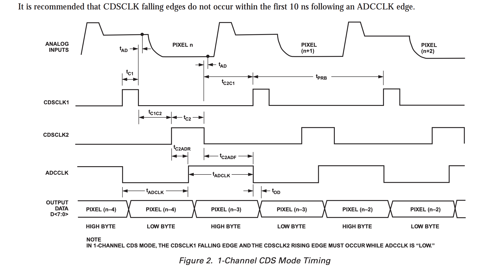
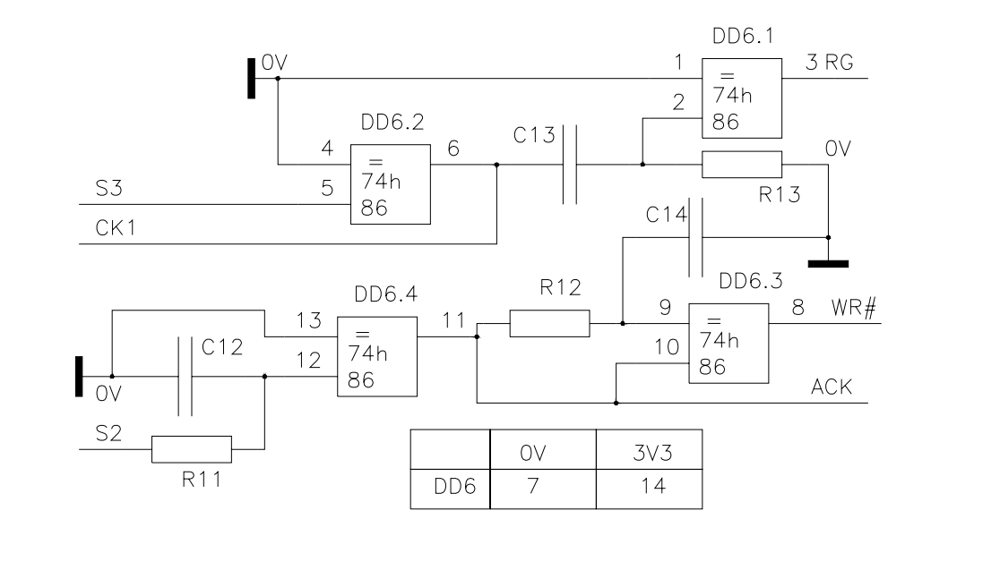

## ADC input signal

* The video output of the CCD is routed to the ADC via an [AD811](https://www.analog.com/media/en/technical-documentation/data-sheets/AD811.pdf)
operational amplifier

## Timing Diagram

The ADC is run in single channel, correlated double sampling (CDS mode). The above diagrams shows the basic timing diagram for this mode. Key elements are:

1. The reference level of the input signal is sampled on the falling edge of the ``CDSCLK1``
1. The signal level is sampled on the falling edge of the ``CDSCLK2
1. Data output bytes are made availalbe on the 8bit output bus after each edge of ``ADCCLK``
1. There is a latency of 3 pixels between sampling and reading of output
1. The high byte of pixel n-3 is made available on the rising edge of ``ADCCLLD`` just before signal is sampled for pixel n
1. The low byte of pixel n-3 is made available on the following falling edge of ``ADCCLLD``

All timing signals originate form the in-camera ATMeg328P MCU with some additional conditioning provided by dedicated logic gates (see below)

## Configuring the ADC

* The ADC is configured via its serial port
* In camera configuration is performed by remote driver software operating via the USB hub pins ``BDBUS0, 1 & 2``
* Perhaps a better design would have the in camera MCU configure the ADC?

## Data output

* Data presented on the 8-bit output bus of the ADC is routed to port ``DABUS`` on the USB hub
* A write pulse is generated by the MCU causing the byte to be latched and transmitted to the remote computer over the USB connection

## ACK and WR# generation

The ``ACK`` and ``WR#`` signals are generated by dedicated logic driven by the ``S2`` output from the MCU. See diagram below

* ``ACK`` will reflect the value of ``S3``
* Each trasition of ``S3`` will cause a brief pulse at ``WR#``
* The width of the ``WR#`` pulse will be determined by ``C14`` and ``R12``

