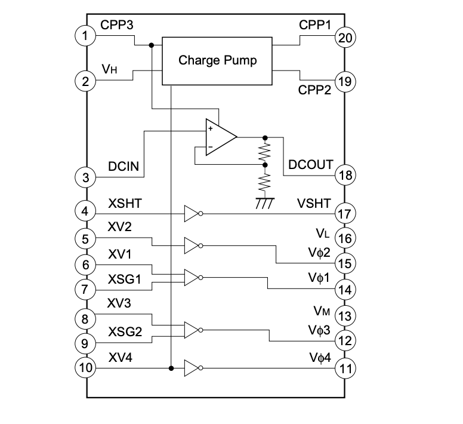
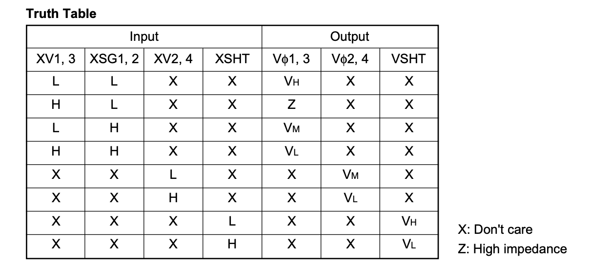

# Vertical driver operation

The timing singnals required to drive the vertical and horizontal shift registers of a CCD sensor are complex. This page describes the timing
circuits for the vertical shift register.

## Dedicated vertical driver chip

* Sony have developed the [CXD1267 vertical driver chip]() to simplify circuit design

