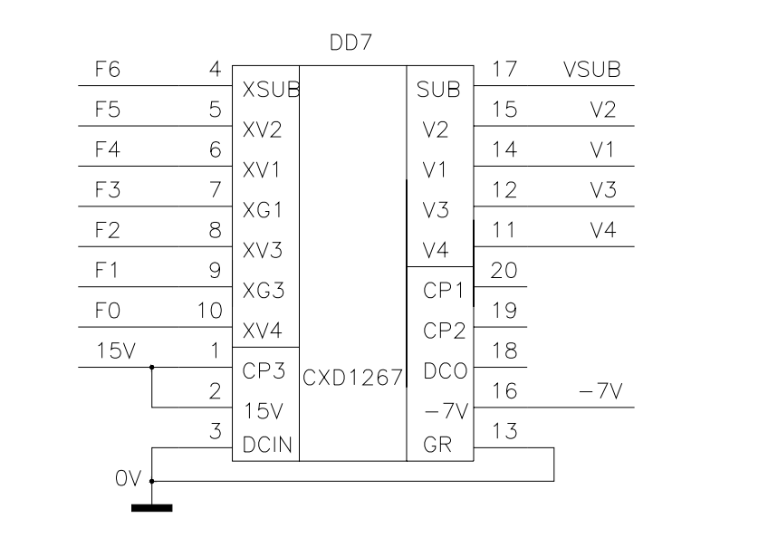

# Vertical driver operation

The timing singnals required to drive the vertical and horizontal shift registers of a CCD sensor are complex. This page describes the timing
circuits for the vertical shift register.

## Dedicated vertical driver chip

* Sony have developed the [CXD1267 vertical driver chip]() to simplify circuit design

## Driver voltages
Looking at the in camera circuit, the following voltages are used to drive the CCD 

| Symbol | Volts         | Pin  |
| -------|:-------------:| -----:|
| VH     | 15V | 2 |
| VM      | 0V     |   13 |
| VL | -7V      |   16 |

## Port D

Port D of the MCU controls the vertical driver as follows

| Port D PIN | PD7   | PD6  | PD5  | PD4 | PD3  | PD2 | PD1  | PD0  |
|------------|-------|------|------|-----|------|-----|------|------|
| CXD        | n/c   | XSUB | XV2  | XV1 | XSG1 | XV3 | XSG2 | XV4  |
| DRIVES     | UPS   | VSUB |  V2  |  V1 |  V1  |  V3 |  V3  |  V4  |
|------------|-------|------|------|-----|------|-----|------|------|
| Values     | 1=15V | 1=VH | 1=VL |  *  |  *   |   * |   *  | 1=VL |
|            | 0=??V | 0=VL | 0=VM |  *  |  *   |   * |   *  | 0=VM |

## Tri-value signals V1 and V3

| XVn  | XSGn |  Vn  |
|------|------|------|
|  L   |   L  |  VH  |
|  L   |   H  |  VM  |
|  H   |   L  |  Z   |
|  H   |   H  |  VL  |

* Z = high impediance state
